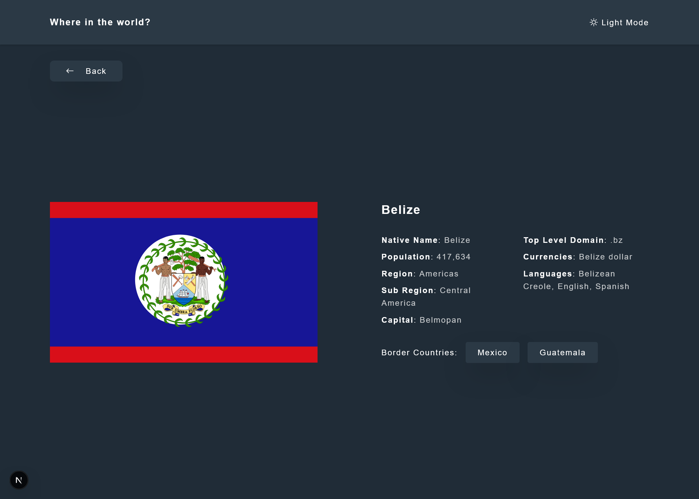
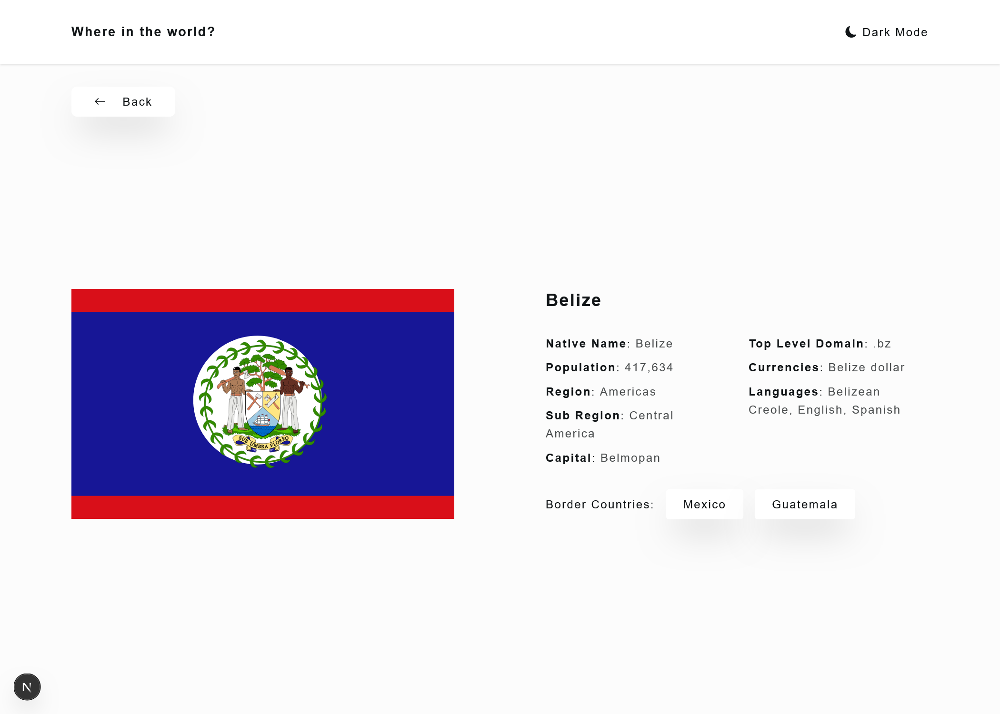
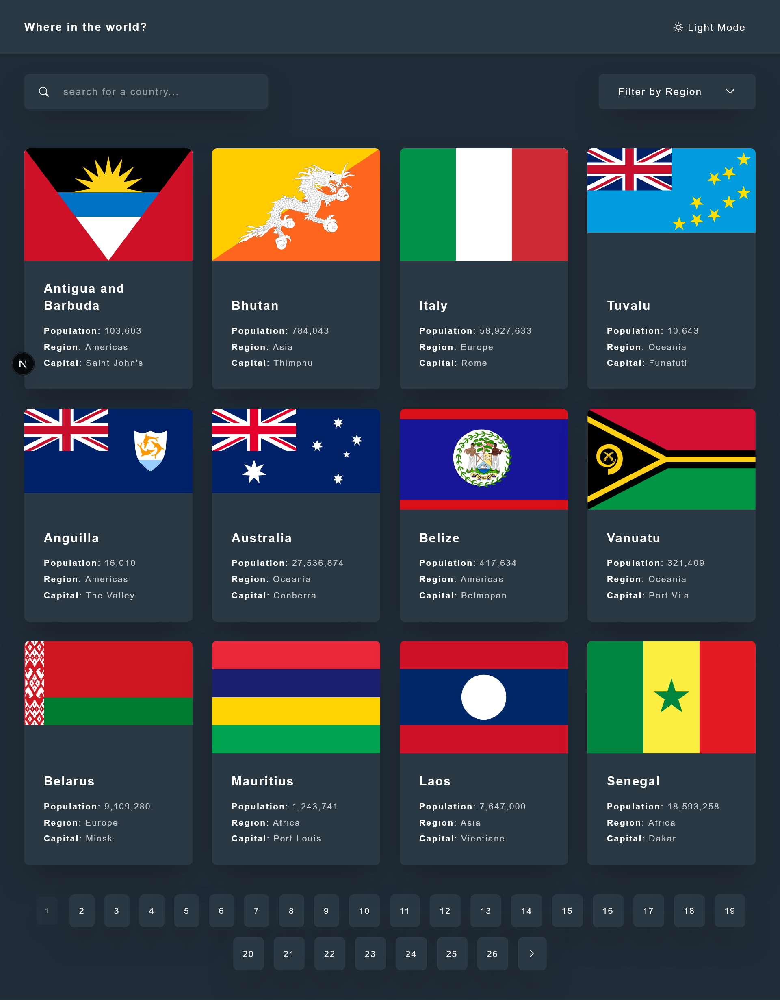
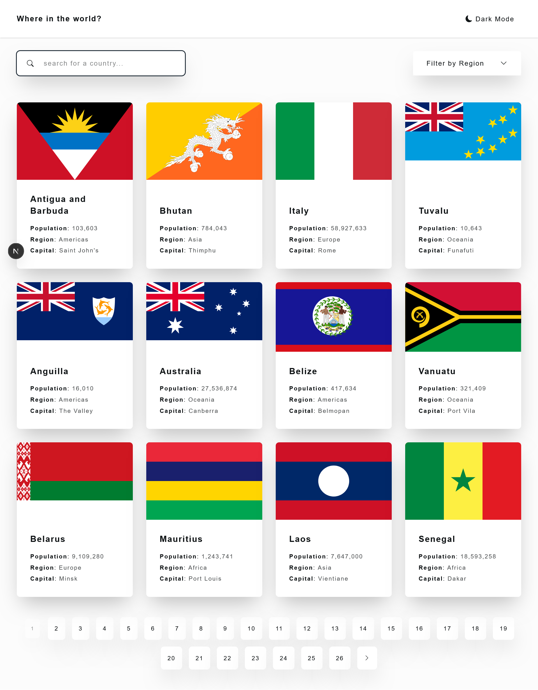
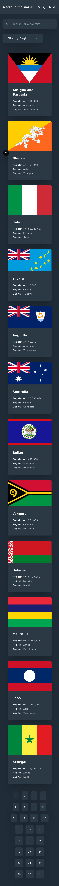
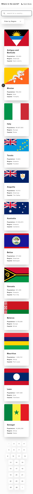

# Frontend Mentor - REST Countries API with color theme switcher solution

This is a solution to the [REST Countries API with color theme switcher challenge on Frontend Mentor](https://www.frontendmentor.io/challenges/rest-countries-api-with-color-theme-switcher-5cacc469fec04111f7b848ca). Frontend Mentor challenges help you improve your coding skills by building realistic projects.

## Table of contents

- [Overview](#overview)
  - [The challenge](#the-challenge)
  - [Screenshot](#screenshot)
  - [Links](#links)
- [My process](#my-process)
  - [Built with](#built-with)
  - [What I learned](#what-i-learned)
  - [Continued development](#continued-development)
  - [Useful resources](#useful-resources)
- [Author](#author)
- [Acknowledgments](#acknowledgments)

**Note: Delete this note and update the table of contents based on what sections you keep.**

## Overview

### The challenge

Users should be able to:

- See all countries from the API on the homepage
- Search for a country using an `input` field
- Filter countries by region
- Click on a country to see more detailed information on a separate page
- Click through to the border countries on the detail page
- Toggle the color scheme between light and dark mode _(optional)_

Get up and running with few steps:

- Install the dependancies
  ```bash
  pnpm install
  ```
- Start the server
  ```bash
  pnpm dev
  ```
- Build a production preview
  ```bash
  pnpm build
  ```

### Screenshot










### Links

- Solution URL: [Github Repo](https://github.com/vickbk/rest-countries-api/)
- Live Site URL: [Deployed on vercel](https://rest-countries-api-six-rosy.vercel.app/)

## My process

### Built with

- Semantic HTML5 markup
- CSS custom properties
- Mobile-first workflow
- [SASS](https://sass-lang.com/) - CSS Preprocessor
- [Tailwindcss](https://tailwindcss.com/) - CSS frameword
- [React](https://reactjs.org/) - JS library
- [Styled Components](https://styled-components.com/) - For styles

### What I learned

In this section I reviewed the routing concept I was learning in this learning path.
I enjoyed using the nextjs routing system for this project.

### Continued development

After this project, I will continue to read best practices for framework usage, I also didn't implement unit testing for separate components which will be my focus from now on.

### Useful resources

- [Roadmap](https://roadmap.sh) - Helped me get started with this journey and still leading me throughout the process
- [Frontend Mentor](https://www.frontendmentor.io) - Currently working with frontend mentor is upskilling me and I want to learn more here... Im not yet to leave
- [Learn NextJS](https://nextjs.org/learn?utm_source=next-site&utm_medium=homepage-cta&utm_campaign=home) - Introduced me to routing and server side state management... a really great resource

## Author

- Github - [@vickbk](https://github.com/vickbk)
- Frontend Mentor - [@vickbk](https://www.frontendmentor.io/profile/vickbk)
- Twitter - [@Vick_bk8](https://x.com/Vick_bk8)

## Acknowledgments

For this project I use most of the knowlegde I got from the frontend roadmap, frontendmentor for HTML & css tricks and technics, accessibility and various developement techniques...
